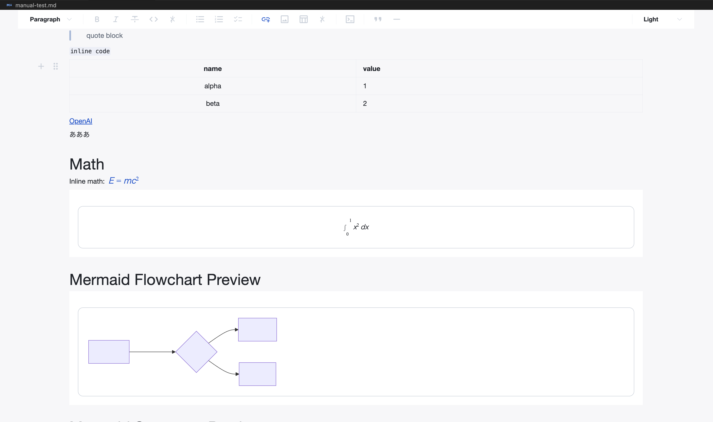

# MarkCanvas



MarkCanvas is an experimental VS Code custom editor extension for editing Markdown in a rendered, canvas-like experience.
It uses Milkdown/Crepe for WYSIWYG editing, renders Mermaid code fences as previews, and recognizes linked draw.io SVG assets so you can jump back to the source diagram file.

## Status

This repository is ready for local development and OSS collaboration, but it is not yet published to the VS Code Marketplace.
The package currently targets desktop VS Code and uses the Markdown file itself as the single source of truth.

## Features

- Rendered Markdown editing with a custom editor powered by Milkdown
- Mermaid preview inside fenced code blocks
- draw.io SVG detection for `*.drawio.svg` files and SVGs with embedded draw.io metadata
- Theme-aware preview switching for light, dark, and system modes
- Two-way synchronization with the underlying Markdown document, including external edits and undo/redo

## Requirements

- VS Code `1.90` or later
- Node.js `20` or later
- npm

## Getting Started

### Run Locally

```bash
npm install
npm run build
```

Then open the repository in VS Code and press `F5` to launch an Extension Development Host.
Inside the development host:

1. Open any Markdown file.
2. Run `MarkCanvas: Open in MarkCanvas`, or use the explorer/editor context menu entry `Open in MarkCanvas`.

For manual verification, use [docs/manual-test.md](docs/manual-test.md).

### Useful Scripts

- `npm run build`: build the extension and webview bundles into `dist/`
- `npm run watch`: rebuild on file changes during development
- `npm run typecheck`: run TypeScript type checking without emitting files
- `npm run test:extension`: run the extension smoke test suite

## Project Layout

- [src/extension.ts](src/extension.ts): extension activation and command registration
- [src/provider.ts](src/provider.ts): custom editor provider and document/webview synchronization
- [src/webview](src/webview): webview application, editor behavior, and preview UI
- [docs/manual-test.md](docs/manual-test.md): manual QA scenario for local validation
- [docs/implementation-plan.md](docs/implementation-plan.md): implementation scope and design notes

## Known Limitations

- Desktop VS Code only. Web extension support is out of scope for the current version.
- The extension is not packaged for Marketplace distribution yet.
- draw.io support only applies to linked SVG files that either end with `.drawio.svg` or contain embedded draw.io metadata.
- Markdown text remains canonical; the rendered editor does not store its own parallel document format.

## Contributing

Contributions are welcome. Read [CONTRIBUTING.md](CONTRIBUTING.md) before opening a pull request.
Issues and pull requests are welcome in either English or Japanese.

## Security

Please report vulnerabilities privately when possible. See [SECURITY.md](SECURITY.md).

## Code of Conduct

This project follows the rules in [CODE_OF_CONDUCT.md](CODE_OF_CONDUCT.md).

## License

This project is licensed under the [MIT License](LICENSE).
