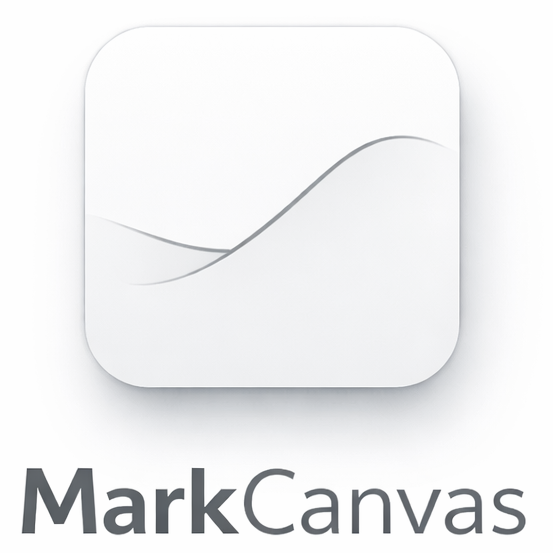

# MarkCanvas




MarkCanvas is an experimental VS Code custom editor for Markdown. It opens `.md` files in a rendered, canvas-like editing experience powered by Milkdown/Crepe while keeping the Markdown file itself as the source of truth.

## What It Does

- Edit Markdown in a rendered custom editor instead of a plain text buffer
- Preview Mermaid code fences inline
- Detect linked draw.io SVG assets and jump back to the source diagram file
- Stay in sync with external edits, undo/redo, and VS Code theme changes

## Why MarkCanvas

Traditional Markdown editing is text-first. MarkCanvas explores a different workflow: keep Markdown as Markdown, but interact with it through a richer visual editor inside VS Code.

This project is a good fit if you want:

- a custom-editor approach instead of a separate preview pane
- a lightweight visual editing layer without introducing a proprietary document format
- better handling for Mermaid and draw.io-heavy Markdown documents

## Current Scope

MarkCanvas currently targets desktop VS Code and local Markdown files.

Known limitations:

- Web extension support is out of scope for the current version
- draw.io support only applies to linked SVG files that end with `.drawio.svg` or contain embedded draw.io metadata
- Markdown remains canonical; MarkCanvas does not maintain a parallel document model

## Getting Started

### Run From Source

Requirements:

- VS Code `1.45` or later
- Node.js `20` or later
- npm

Install dependencies and build the extension:

```bash
npm install
npm run build
```

Then open this repository in VS Code and press `F5` to launch an Extension Development Host.

Inside the development host:

1. Open any Markdown file.
2. Run `MarkCanvas: Open in MarkCanvas`.

You can also use the `Open in MarkCanvas` entry from the explorer or editor context menu for `.md` files.

## Development

Useful scripts:

- `npm run build`: build the extension and webview bundles into `dist/`
- `npm run watch`: rebuild on file changes during development
- `npm run typecheck`: run TypeScript type checking without emitting files
- `npm run test`: run the roundtrip and extension test suites
- `npm run test:roundtrip`: run Markdown roundtrip tests
- `npm run test:extension`: run the VS Code extension smoke tests
- `npm run package:vsix`: create a `.vsix` package
- `npm run package:vsix:pre-release`: create a pre-release `.vsix` package

Manual verification notes live in [docs/manual-test.md](docs/manual-test.md). A sample showcase document is available in [docs/demo-showcase.md](docs/demo-showcase.md).

## Project Layout

- [src/extension.ts](src/extension.ts): extension activation and command registration
- [src/provider.ts](src/provider.ts): custom editor provider and document synchronization
- [src/webview](src/webview): webview UI, rendered editing behavior, and previews
- [test](test): roundtrip and extension test suites
- [docs](docs): sample content, manual test notes, and implementation docs

## Contributing

Contributions, issues, and pull requests are welcome. See [CONTRIBUTING.md](CONTRIBUTING.md) for development and contribution guidelines.

## Security

If you find a security issue, please report it privately when possible. See [SECURITY.md](SECURITY.md).

## Code of Conduct

This project follows [CODE_OF_CONDUCT.md](CODE_OF_CONDUCT.md).

## License

Released under the [MIT License](LICENSE).
