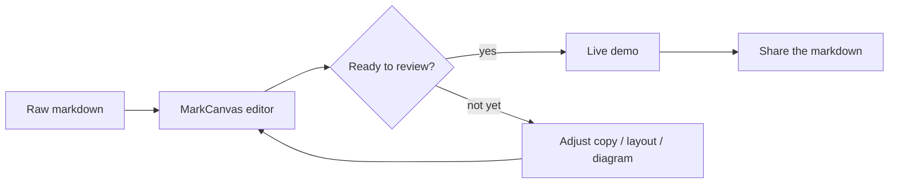
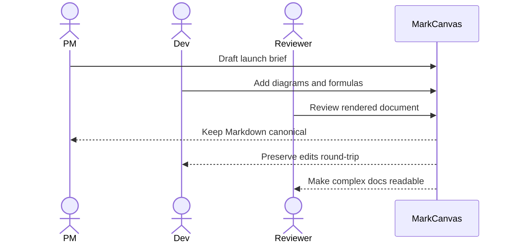
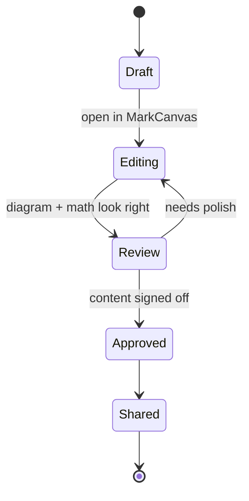

# MarkCanvas Demo Showcase

MarkCanvas のデモ表示用に、見た目が大きく変わる要素をまとめた Markdown サンプルです。
`Open in MarkCanvas` で開いて、レイアウト、Mermaid、数式、画像、編集追従をまとめて確認してください。

---

## Launch Sequence

> Mission control log
>
> The editor switches from plain Markdown into a rendered canvas with diagrams, formulas, tables, and linked assets.

- Visual editing
- Mermaid preview
- Math blocks
- Linked assets
- Round-trip safe Markdown

### Status Board

| System | State | Notes |
| ------ | ----- | ----- |
| Editor Surface | ONLINE | Toolbar + rendered blocks |
| Mermaid Engine | ONLINE | Flowchart, sequence, state |
| Formula Layer | ONLINE | Inline and block math |
| Asset Bridge | ONLINE | draw.io SVG jump-back |
| Sync Loop | ONLINE | External edits reflected |

### Checklist

- [x] Render headings with strong hierarchy
- [x] Render tables and quotes cleanly
- [x] Render Mermaid blocks inline
- [x] Render math without collapsing layout
- [ ] Add your own notes and confirm Markdown stays canonical

---

## Hero Copy

# Build docs like a control room

MarkCanvas is useful when a plain text file needs to read like a presentation board.
You can mix specs, launch plans, diagrams, equations, and linked assets in one document without leaving Markdown.

**Current mode:** cinematic demo  
**Target audience:** teammates, reviewers, and anyone watching over your shoulder

---

## Signal Snapshot

1. Open this file in MarkCanvas.
2. Scroll once to see how section rhythm changes between text, tables, diagrams, and formulas.
3. Edit any sentence in place and verify the Markdown file remains the source of truth.

### Inline Expressions

- Escape velocity estimate: $v_e = \sqrt{\frac{2GM}{r}}$
- Signal decay: $A(t) = A_0 e^{-kt}$
- Simple score: $S = 3f + 2m + r$

### Block Math

$$
\mathrm{LaunchScore} =
\sum_{i=1}^{n} w_i x_i
\quad \text{where} \quad
\sum_{i=1}^{n} w_i = 1
$$

$$
\begin{aligned}
\text{throughput} &= \frac{\text{accepted requests}}{\text{second}} \\
\text{latency budget} &= 120\text{ms} - \text{network} - \text{render} - \text{sync}
\end{aligned}
$$

---

## Flight Plan Diagram



## Team Handoff Sequence



## System State



---

## Command Deck

### Code Fence

```ts
type DemoSignal = {
  section: string;
  visualWeight: 'high' | 'medium' | 'low';
  rendered: boolean;
};

const signals: DemoSignal[] = [
  { section: 'Hero Copy', visualWeight: 'high', rendered: true },
  { section: 'Flight Plan Diagram', visualWeight: 'high', rendered: true },
  { section: 'Command Deck', visualWeight: 'medium', rendered: true },
];
```

### Quote Stack

> "Markdown is the source of truth."
>
> "Render it like a dashboard."
>
> "Keep the file portable."

### Mixed Content

| Track | Owner | ETA | Risk |
| ----- | ----- | --- | ---- |
| Demo Story | PM | 2h | Low |
| Diagram Polish | Design | 1h | Medium |
| Final Copy | Dev | 30m | Low |
| Dry Run | Team | 20m | Medium |

---

## Linked Assets

### Draw.io SVG

This image should expose the draw.io action in MarkCanvas.


### Plain SVG

This image should render normally without the draw.io action.


### Missing Image

This broken reference should fail gracefully without breaking the editor.


---

## Final Prompt

If you are demoing this live, try these edits:

- Rewrite the hero heading
- Change one table value
- Modify the Mermaid text labels
- Insert one extra inline formula like $P = VI$
- Save and reopen the file
