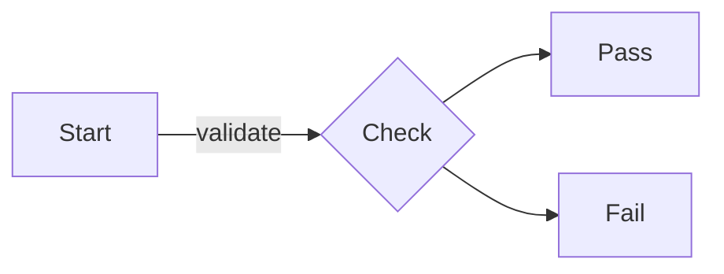
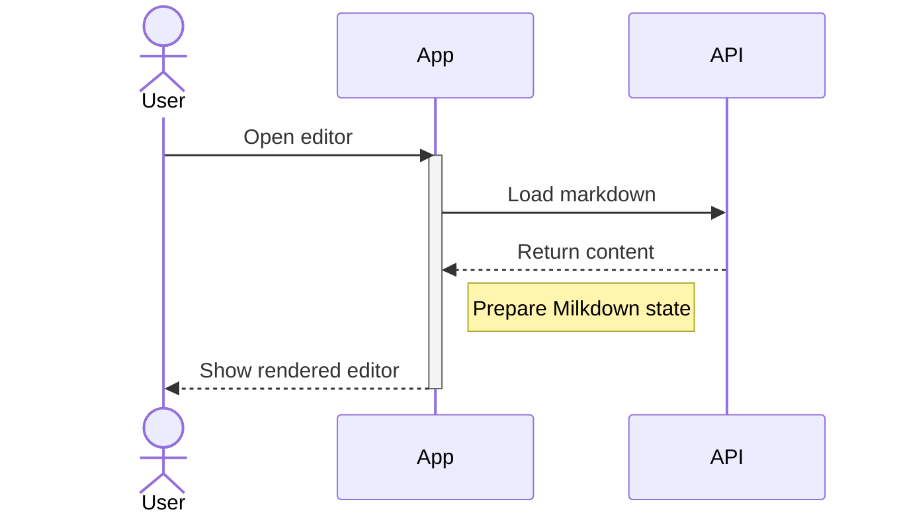
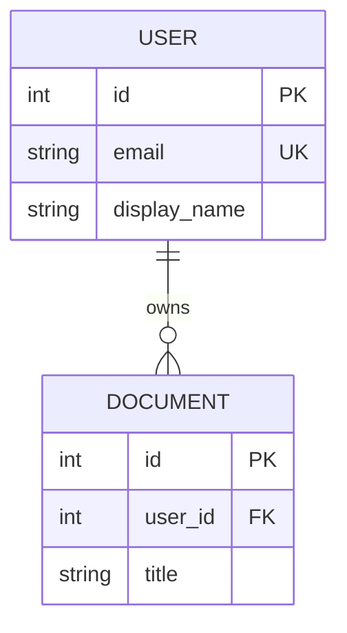
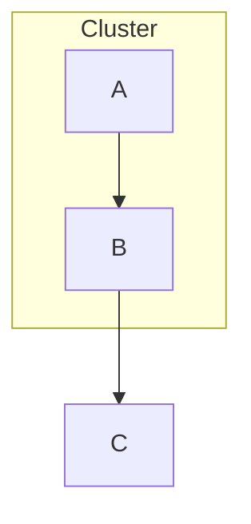
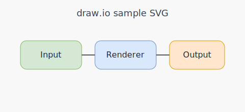
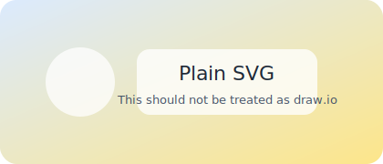

# MarkCanvas Manual Test

このファイルは VSCode Extension Development Host での手動確認用です。

## How To Use

1. このワークスペースを VSCode で開く
2. `F5` で `Run MarkCanvas` を起動する
3. 開いた Extension Development Host 側でこのファイルを開く
4. `Open in MarkCanvas` を実行する

数式だけを確認したい場合は `docs/math-sample.md` を開いて同じ手順で確認します。
派手なデモ表示を確認したい場合は `docs/demo-showcase.md` を開いてください。

## Milkdown Basics

# Heading

* bullet one

* bullet two

1. ordered one
2. ordered two

> quote block

`inline code`

|  name | value |
| :---: | ----- |
| alpha | 1     |
|  beta | 2     |

[OpenAI](https://openai.com/)

あああ

## Math

Inline math: $E = mc^2$

$$
\int_0^1 x^2 \, dx
$$

## Mermaid Flowchart Preview

## Mermaid Sequence Preview

## Mermaid ER Preview

## Mermaid Complex Preview

このブロックは複雑な構文でも preview だけ表示されることを確認します。

## Draw\.io SVG

下の画像は draw\.io 判定される想定です。`Open Diagram File` が出ることを確認します。

## Plain SVG

下の画像は通常 SVG として扱われ、draw\.io のアクションが出ないことを確認します。

## Missing Asset

存在しない画像でもエディタ全体が壊れないことを確認します。

