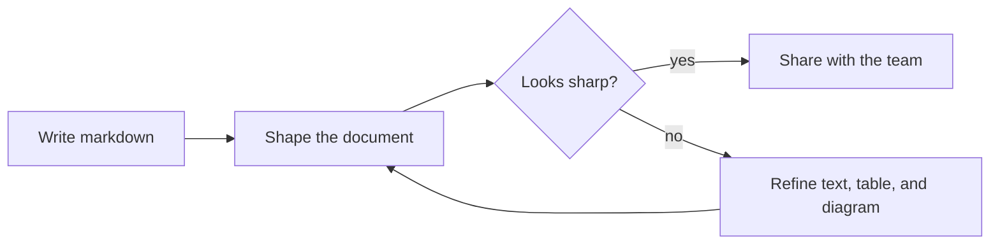

<!--
README のトップ画像を撮るための専用サンプルです。
推奨:
- VS Code ウィンドウ幅を広めにする
- `Open in MarkCanvas` で開く
- サイドバーを閉じる
- 1 画面に収まる位置で撮る
-->

# Mission Control Brief

MarkCanvas turns plain Markdown into a visual working surface for specs, diagrams, formulas, and review-ready notes.

## Live Snapshot

* Rendered Markdown editing

* Mermaid preview

* Math blocks

* Round-trip safe source

| Module  | Status | Signal    |
| ------- | ------ | --------- |
| Editor  | Online | Stable    |
| Mermaid | Online | Rendering |
| Math    | Online | Typeset   |
| Assets  | Online | Linked    |

 

Inline math: $E = mc^2$ and $S = \sum_{i=1}^{n} w_i x_i$

$$
\text{readability} = \text{markdown} + \text{layout} + \text{preview fidelity}
$$

## Launch Flow

